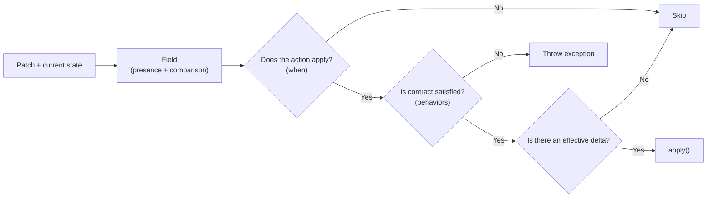

# PHP Delta Orchestrator

[](https://github.com/vaened/php-delta-orchestrator/actions/workflows/test.yml)
[](LICENSE)

**php-delta-orchestrator** is a library for orchestrating partial updates by comparing incoming input against the current state, producing a
[`Delta`](src/Delta.php) and executing [`Action`](src/Action.php) instances only when appropriate.

```php
// Patch + current state
$startDate = Field::from(
    // incoming patch vs current value
    patch  : $payload->startDate,
    current: $availability->startDate,
);

$endDate = Field::from(
    patch  : $payload->endDate,
    current: $availability->endDate,
);

$orchestrator = new Orchestrator();

$orchestrator->register(
    Action::from(
        fields: [$startDate, $endDate],
        // runs only if the action applies, contract is satisfied, and there is an effective delta
        apply : function (Field $startDate, Field $endDate): void {
            // use $field->delta(), $field->value(), $field->current()
        },
    ),
);

$result = $orchestrator->execute();
```

## Installation

Delta Orchestrator requires PHP 8.2 or higher and can be installed via Composer:

```bash
composer require vaened/php-delta-orchestrator
```

## Problem it solves

### Traditional approach

When handling partial updates, code tends to quickly degrade into scattered conditional logic:

* checking whether a field is present in the input,
* comparing it with the current value,
* deciding whether to execute business logic,
* avoiding unnecessary operations when nothing has changed.

This usually leads to nested conditionals, duplicated comparison logic, and implicit rules spread across the application layer.

The core issue is that this approach mixes in the same place:

* input handling,
* change detection,
* action execution.

### This library’s approach

An explicit flow is introduced where each responsibility is clearly separated:

* [`PatchValue`](src/Patch/PatchValue.php) models input presence and normalization,
* [`Field`](src/Field.php) evaluates changes against the current state,
* [`Delta`](src/Delta.php) represents an effective transition,
* [`Action`](src/Action.php) defines when and how to execute logic.

## Conceptual model

The library organizes the flow of a partial update into explicit steps:



## Usage

The following section shows how to apply the flow defined in the conceptual model.

### 1) Model patchable input

You can represent partial input in two ways.

#### Option A: Typed command

```php
final readonly class UpdateAvailabilityCommand
{
    public function __construct(
        public DateTimeImmutablePatchValue $startDate,
        public DateTimeImmutablePatchValue $endDate,
    ) {}
}
```

#### Option B: From array using [`PatchInput`](src/Patch/PatchInput.php)

```php
$input = new PatchInput(
    input: $request->all(),
);

$startDate = $input->dateTimeImmutable('start_date');
$endDate   = $input->dateTimeImmutable('end_date');
```

`PatchValue` represents:

* presence (`isPresent()`)
* incoming value (`value()`), potentially normalized

Concrete patch values also expose lightweight named constructors when you want to instantiate them directly:

```php
$name = StringPatchValue::from(true, 'Juan');
$email = StringPatchValue::present('juan@example.com');
$timezone = StringPatchValue::missing();
```

### 2) Define fields

You connect the patch with the current state using [`Field::from()`](src/Field.php). Each `patch` represents a `PatchValue`, not the final
value, so the incoming value may differ in type from the current state.

```php
$startDate = Field::from(
    patch  : $payload->startDate,
    current: $availability->startDate,
);
```

You can optionally define a comparator:

```php
$endDate = Field::from(
    patch  : $payload->endDate,
    current: $availability->endDate,
)->using(comparator: DateTimeComparator::create());
```

You can also transform the incoming patch value before comparison and action execution:

```php
$name = Field::from(patch  : $payload->name, current: $current->name)
             ->transform(static fn(string $value): string => strtolower(trim($value)))
             ->using(comparator: StrictComparator::create());
```

Each [`Field`](src/Field.php) exposes:

* `isPresent()` → whether the field was provided in the patch
* `isChanged()` → whether the field has a real delta against the current value
* `value()` → incoming value
* `current()` → current value
* `effective()` → incoming value when present, otherwise current value
* `changed()` → incoming value when a real change exists, otherwise `null`
* `delta()` → returns the transition (`previous → next`) if a change exists, or `null` otherwise

### 3) Declare actions

You define what should happen when a combination of fields applies through an [`Action`](src/Action.php).

```php
$orchestrator->register(
    Action::from(
        fields: [$startDate, $endDate],
        apply : function (Field $startDate, Field $endDate): void {
            // call to application/domain service
        },
    )->when(static fn(Field ...$fields) => any($fields))
     ->describe('Update availability period'),
);
```

You can also define a custom failure to be rethrown later:

```php
$orchestrator->register(
    Action::from(
        fields: [$startDate->required(), $endDate->optional()],
        apply : function (Field $startDate, Field $endDate): void {
            // call to application/domain service
        },
    )
        ->describe('Update availability period')
        ->or(static fn(ActionFailure $failure) => new DomainException(
            message : 'The action contract was not satisfied.',
            previous: $failure,
        )),
);
```

#### Behaviors

Behaviors define the execution contract through [`Required`](src/Bindings/Required.php) and [`Optional`](src/Bindings/Optional.php):

```php
fields: [
    $startDate->required(),
    $endDate->optional(),
]
```

* `required()` → the field must provide a usable value
* `optional()` → the field may be absent

#### Activation rule (`when`)

`when` determines whether the action participates in the current patch.

By default, an action applies if **at least one field is present**.

You can define custom rules:

```php
Action::from(
    fields: [$startDate, $endDate],
    apply : static function (Field $startDate, Field $endDate): void {
        // ...
    },
)->when(static fn(Field ...$fields) => all($fields));
```

For the common presence-based cases, you can pass the provided named constructors directly:

```php
Action::from(
    fields: [$startDate, $endDate],
    apply : static function (Field $startDate, Field $endDate): void {
        // ...
    },
)->when(All::isPresent());
```

If the decision was already resolved elsewhere, you can pass the resulting boolean directly:

```php
Action::from(
    fields: [$startDate, $endDate],
    apply : static function (Field $startDate, Field $endDate): void {
        // ...
    },
)->when(Boolean::from($shouldUpdateAvailability));
```

If you want to treat `when(...)` like an inline boolean guard, you can wrap it as a rule:

```php
Action::from(
    fields: [$startDate, $endDate],
    apply : static function (Field $startDate, Field $endDate): void {
        // ...
    },
)->when(Boolean::resolve(
    static function(Field $startDate, Field $endDate): bool {
        // custom guard: skip this action entirely when an external policy forbids the update
    }
));
```

### 4) Execute orchestrator

```php
$result = $orchestrator->execute();
```

The [`Orchestrator`](src/Orchestrator.php) performs:

1. Evaluates `when` (presence-based activation)
2. Validates the contract (`behaviors`)
3. Checks for an effective delta
4. Executes `apply()` if applicable

`execute()` returns an [`ExecutionResult`](src/ExecutionResult.php), so you can react to the run outcome:

When a required behavior is not satisfied, `execute()` throws [`ActionBehaviorNotSatisfied`](src/Exceptions/ActionBehaviorNotSatisfied.php).
If the action
defined a custom `or(...)` strategy, you can inspect the failure first and then relaunch it with `rethrow()`.

It includes totals and execution state (`total`, `executed`, `skipped`) plus helper checks and description-based lookups.

```php
if ($result->hasEffects()) {
    // persist / publish events
}
```

```php
try {
    $orchestrator->execute();
} catch (ActionBehaviorNotSatisfied $failure) {
    // inspect $failure->progressUntilFailure(), $failure->field(), etc.
    $failure->rethrow();
}
```

### Note on current vs patch values

The library does not automatically build a projected state.

If you need the effective value for a field (patch value when present, otherwise current value), use `effective()`:

```php
$start = $startDate->effective();
```

This keeps action code cleaner while preserving explicit field-level behavior.

## Rules

Rules allow you to declaratively define activation conditions (`when`) through helpers in [
`src/Rules/functions.php`](src/Rules/functions.php).

### present()

Checks whether a field is present in the patch.

```php
present($startDate)
```

### all() and any()

Allow composing conditions:

```php
use function Vaened\DeltaOrchestrator\Rules\all;
use function Vaened\DeltaOrchestrator\Rules\any;

all([$startDate, $endDate]);
any([$startDate, $endDate]);
```

You can also nest rules:

```php
all([
    $startDate,
    any([$endDate, $publishedAt]),
]);
```

## Activation (`when`)

Advanced details on how to define custom activation rules.

```php
$action = Action::from(
    fields: [$startDate, $endDate],
    apply : static function (Field $startDate, Field $endDate): void {
        // ...
    },
)->when(All::isPresent());;
```

`when` determines whether the action participates in the current patch.

## Field

### Comparators

Each `Field` compares the incoming value against the current value using a comparator.

#### Default

If none is defined, `StrictComparator` is used.

* compares strictly by type and value,
* compares dates by exact temporal value,
* throws `ComparisonTypeMismatch` if types are not compatible.

#### NumericComparator

For numeric values and numeric strings.

```php
$quantity = Field::from(
    patch  : $payload->quantity,
    current: $current->quantity,
)->using(comparator: NumericComparator::create());
```

#### DateTimeComparator

For date comparisons with explicit semantics.

```php
$startDate = Field::from(
    patch  : $payload->startDate,
    current: $current->startDate,
)->using(comparator: DateTimeComparator::create());
```

#### LooseComparator

For cases where intentional loose comparison (`==`) is desired.

```php
$value = Field::from(
    patch  : $payload->value,
    current: $current->value,
)->using(comparator: LooseComparator::create());
```

#### ArrayComparator

For recursive array comparisons, with support for injecting an item comparator.

```php
$settings = Field::from(
    patch  : $payload->settings,
    current: $current->settings,
)->using(comparator: ArrayComparator::create());
```

You can also provide a custom comparator for leaf values:

```php
$settings = Field::from(
    patch  : $payload->settings,
    current: $current->settings,
)->using(comparator: ArrayComparator::create(LooseComparator::create()));
```

## Patch (input)

### PatchValue and normalization

Concrete [`PatchValue`](src/Patch/PatchValue.php) implementations can accept flexible inputs and return normalized values.

```php
new IntPatchValue(true, '20')->value();
new BoolPatchValue(true, 'true')->value();
new DateTimeImmutablePatchValue(true, '2026-04-26 10:20:30')->value();
```

This keeps normalization at the input boundary, preventing raw values from leaking into the domain.

## Playground

The repository includes an executable usage scenario located at [`playground/playground.php`](playground/playground.php).

Unlike the snippets in the README, this example brings multiple cases together in a single flow:

* multiple `Action` instances over the same patch,
* combination of `required()` and `optional()`,
* use of `when` to control activation by presence,
* cases with and without effective `delta`,
* use of current values as fallback,
* a contract failure case (`required` with `null`).

The scenario is not intended to be minimal. It deliberately groups more logic than usual to expose different behaviors in a single
execution.

### Run

```bash
make playground
```

## Additional documentation

You can find more details in the source code as well as in the tests located in [`tests/`](tests).

The tests cover different usage scenarios and can serve as additional reference for understanding the library’s behavior.
