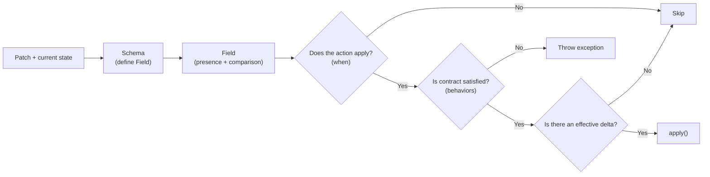

# PHP Delta Orchestrator

[](https://github.com/vaened/php-delta-orchestrator/actions/workflows/test.yml)
[](LICENSE)

**php-delta-orchestrator** is a library for orchestrating partial updates by comparing incoming input against the current state, producing a
[`Delta`](src/Delta.php) and executing [`Action`](src/Action.php) instances only when appropriate.

```php
// Patch + current state
$schema = new Schema($payload, $availability);

$startDate = $schema->define(
    // incoming patch vs current value
    patch  : fn(UpdateAvailabilityCommand $payload) => $payload->startDate,
    current: fn(Availability $current) => $current->startDate,
);

$endDate = $schema->define(
    patch  : fn(UpdateAvailabilityCommand $payload) => $payload->endDate,
    current: fn(Availability $current) => $current->endDate,
);

$orchestrator = new Orchestrator();

$orchestrator->register(new Action(
    fields: [$startDate, $endDate],
    // runs only if the action applies, contract is satisfied, and there is an effective delta
    apply: function (Field $startDate, Field $endDate): void {
        // use $field->delta(), $field->value(), $field->current()
    },
));

$orchestrator->execute();
```

## Installation

Delta Orchestrator requires PHP 8.2 or higher and can be installed via Composer:

```bash
composer require vaened/php-delta-orchestrator
```

## Problem it solves

### Traditional approach

When handling partial updates, code tends to quickly degrade into scattered conditional logic:

* checking whether a field is present in the input,
* comparing it with the current value,
* deciding whether to execute business logic,
* avoiding unnecessary operations when nothing has changed.

This usually leads to nested conditionals, duplicated comparison logic, and implicit rules spread across the application layer.

The core issue is that this approach mixes in the same place:

* input handling,
* change detection,
* action execution.

### This library’s approach

An explicit flow is introduced where each responsibility is clearly separated:

* [`PatchValue`](src/Patch/PatchValue.php) models input presence and normalization,
* [`Field`](src/Field.php) evaluates changes against the current state,
* [`Delta`](src/Delta.php) represents an effective transition,
* [`Action`](src/Action.php) defines when and how to execute logic.

## Conceptual model

The library organizes the flow of a partial update into explicit steps:



## Usage

The following section shows how to apply the flow defined in the conceptual model.

### 1) Model patchable input

You can represent partial input in two ways.

#### Option A: Typed command

```php
final readonly class UpdateAvailabilityCommand
{
    public function __construct(
        public DateTimeImmutablePatchValue $startDate,
        public DateTimeImmutablePatchValue $endDate,
    ) {}
}
```

#### Option B: From array using [`PatchInput`](src/Patch/PatchInput.php)

```php
$input = new PatchInput(
    input       : $request->all(),
    expectedKeys: ['start_date', 'end_date'],
);

$startDate = $input->dateTimeImmutable('start_date');
$endDate   = $input->dateTimeImmutable('end_date');
```

`PatchValue` represents:

* presence (`isPresent()`)
* incoming value (`value()`), potentially normalized

### 2) Define fields

You connect the patch with the current state using [`Schema`](src/Schema.php). Each `patch` represents a `PatchValue`, not the final value,
so the incoming value may differ in type from the current state.

```php
$schema = new Schema($payload, $availability);

$startDate = $schema->define(
    patch  : fn(UpdateAvailabilityCommand $payload) => $payload->startDate,
    current: fn(Availability $current) => $current->startDate,
);
```

You can optionally define a comparator:

```php
$endDate = $schema->define(
    patch  : fn($command) => $command->endDate,
    current: fn($availability) => $availability->endDate,
    compare: DateTimeComparator::create(),
);
```

Each [`Field`](src/Field.php) exposes:

* `isPresent()` → whether the field was provided in the patch
* `value()` → incoming value
* `current()` → current value
* `delta()` → returns the transition (`previous → next`) if a change exists, or `null` otherwise

### 3) Declare actions

You define what should happen when a combination of fields applies through an [`Action`](src/Action.php).

```php
$orchestrator->register(new Action(
    fields     : [$startDate, $endDate],
    apply      : function (Field $startDate, Field $endDate): void {
        // call to application/domain service
    },
    when: static fn(Field ...$fields) => any($fields),
    description: 'Update availability period',
));
```

#### Behaviors

Behaviors define the execution contract through [`Required`](src/Bindings/Required.php) and [`Optional`](src/Bindings/Optional.php):

```php
fields: [
    $startDate->required(),
    $endDate->optional(),
]
```

* `required()` → the field must provide a usable value
* `optional()` → the field may be absent

#### Activation rule (`when`)

`when` determines whether the action participates in the current patch.

By default, an action applies if **at least one field is present**.

You can define custom rules:

```php
when: static fn(Field ...$fields) => all($fields)
```

### 4) Execute orchestrator

```php
$orchestrator->execute();
```

The [`Orchestrator`](src/Orchestrator.php) performs:

1. Evaluates `when` (presence-based activation)
2. Validates the contract (`behaviors`)
3. Checks for an effective delta
4. Executes `apply()` if applicable

### Note on current vs patch values

The library does not automatically build a projected state.

If you need to combine patch values with the current state, you must do it explicitly:

```php
$start = $startDate->isPresent() ? $startDate->value() : $startDate->current();
```

This allows you to control type handling, normalization, and domain rules.

## Rules

Rules allow you to declaratively define activation conditions (`when`) through helpers in [
`src/Rules/functions.php`](src/Rules/functions.php).

### present()

Checks whether a field is present in the patch.

```php
present($startDate)
```

### all() and any()

Allow composing conditions:

```php
use function Vaened\DeltaOrchestrator\Rules\all;
use function Vaened\DeltaOrchestrator\Rules\any;

all([$startDate, $endDate]);
any([$startDate, $endDate]);
```

You can also nest rules:

```php
all([
    $startDate,
    any([$endDate, $publishedAt]),
]);
```

## Activation (`when`)

Advanced details on how to define custom activation rules.

```php
$action = new Action(
    fields: [$startDate, $endDate],
    when  : static fn(Field ...$fields) => all($fields),
    apply : static function (Field $startDate, Field $endDate): void {
        // ...
    },
);
```

`when` determines whether the action participates in the current patch.

## Field

### Comparators

Each `Field` compares the incoming value against the current value using a comparator.

#### Default

If none is defined, `StrictComparator` is used.

* compares strictly by type and value,
* compares dates by exact temporal value,
* throws `ComparisonTypeMismatch` if types are not compatible.

#### NumericComparator

For numeric values and numeric strings.

```php
$quantity = $schema->define(
    patch  : fn($payload) => $payload->quantity,
    current: fn($current) => $current->quantity,
    compare: NumericComparator::create(),
);
```

#### DateTimeComparator

For date comparisons with explicit semantics.

```php
$startDate = $schema->define(
    patch  : fn($payload) => $payload->startDate,
    current: fn($current) => $current->startDate,
    compare: DateTimeComparator::create(),
);
```

#### LooseComparator

For cases where intentional loose comparison (`==`) is desired.

```php
$value = $schema->define(
    patch  : fn($payload) => $payload->value,
    current: fn($current) => $current->value,
    compare: LooseComparator::create(),
);
```

## Patch (input)

### PatchValue and normalization

Concrete [`PatchValue`](src/Patch/PatchValue.php) implementations can accept flexible inputs and return normalized values.

```php
new IntPatchValue(true, '20')->value();
new BoolPatchValue(true, 'true')->value();
new DateTimeImmutablePatchValue(true, '2026-04-26 10:20:30')->value();
```

This keeps normalization at the input boundary, preventing raw values from leaking into the domain.

## Playground

The repository includes an executable usage scenario located at [`playground/playground.php`](playground/playground.php).

Unlike the snippets in the README, this example brings multiple cases together in a single flow:

* multiple `Action` instances over the same patch,
* combination of `required()` and `optional()`,
* use of `when` to control activation by presence,
* cases with and without effective `delta`,
* use of current values as fallback,
* a contract failure case (`required` with `null`).

The scenario is not intended to be minimal. It deliberately groups more logic than usual to expose different behaviors in a single
execution.

### Run

```bash
make playground
```

## Additional documentation

You can find more details in the source code as well as in the tests located in [`tests/`](tests).

The tests cover different usage scenarios and can serve as additional reference for understanding the library’s behavior.
